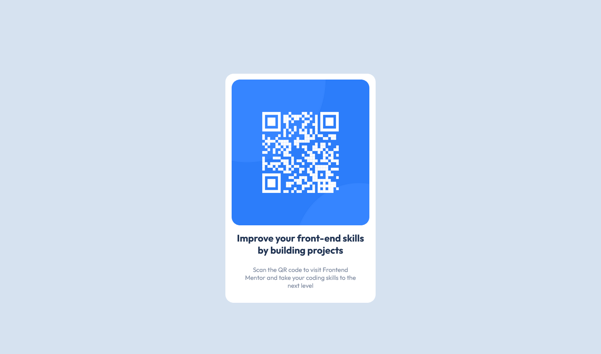

# Frontend Mentor - QR code component solution

This is a solution to the [QR code component challenge on Frontend Mentor](https://www.frontendmentor.io/challenges/qr-code-component-iux_sIO_H). Frontend Mentor challenges help you improve your coding skills by building realistic projects.

## Table Of Conetent

- [Frontend Mentor - QR code component solution](#frontend-mentor---qr-code-component-solution)
  - [Table Of Conetent](#table-of-conetent)
  - [Overview](#overview)
    - [Screenshot](#screenshot)
    - [Links](#links)
  - [My Process](#my-process)
    - [Built with](#built-with)
    - [What I learned](#what-i-learned)
    - [Continued development](#continued-development)
  - [Author](#author)

## Overview
This was my first frontend mentor coding challenge and I really enjoyed it and looking forward to do more.
### Screenshot



### Links
- Solution URL: [solution URL](https://github.com/sarimhasan/Contact-Form-Frontend-Mentor)
- live Site URL: [live site URL](https://sarimhasan.github.io/Contact-Form-Frontend-Mentor/)

## My Process

### Built with
- HTML 5
- CSS Custom properties

### What I learned
I learned alot of things while solving this challenge for example, how to center a div using position absolute:
```css
    top: 50%;
    left: 50%;
    -ms-transform: translate(-50%, -50%);
    transform: translate(-50%, -50%);
```

### Continued development
I am not very well aware of the concepts of css grid and flex box which I will be learning soon.

## Author

- Frontend Mentor - [@sarimhasan](https://www.frontendmentor.io/profile/sarimhasan)
- Twitter - [@Sarim_hs](https://twitter.com/Sarim_hs)